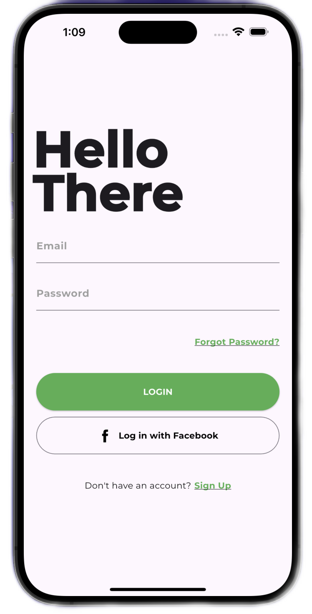

## Flutter Simple Login Page UI Design

```dart
class Day1 extends CodeWithMoyin {
  video() {
    return {
      "title": "Flutter Simple Login Page UI Design",
      "description": "Let's build a Simple Login Page UI following a dribbble design..",
      "videoLink": "https://www.youtube.com/watch?v=_3Pbpq4BG4Q"
    }
  }
}
```

[Watch it on Youtube](https://www.youtube.com/watch?v=_3Pbpq4BG4Q)
<br><br>

## Development Setup
Clone the repository and run the following commands:
```
flutter pub get
flutter run
```

## Design Credit - https://dribbble.com/shots/5239966-Daily-UI-001

## ScreenShots



## Links

* [Website](https://moyinoluwalogo.github.io/)
* [Youtube channel](https://www.youtube.com/@moyinmayowa)